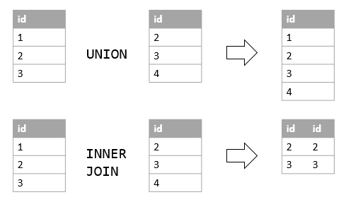
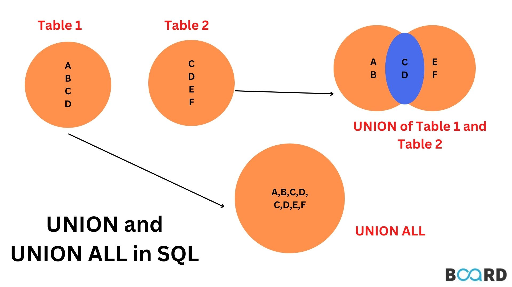
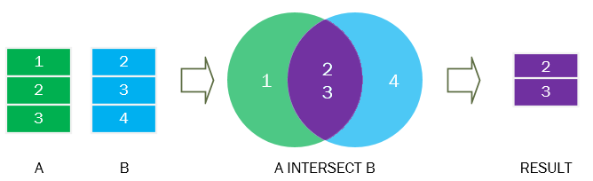
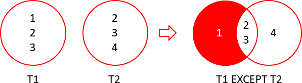

# 1. SQL Overview

## 1.1. SQL and RDBMS
Structured Query Language (SQL) is used to manage and query data stored in a **Relational Database Management System (RDMBS)**.
Essentially, put data in tables and get it out again.

An RDMBS organises data into tables with defined schemas (column names and data types).

SQL is a *declarative* language. You specify what you want to happen, not how to achieve it.
The SQL query engine optimises how the query run internally, e.g. what order to execute commands, what indexes to use.


## 1.2. SQL Flavours
There are different "flavours" of SQL. For example, MySQL, PostegreSQL, SQLite, SQL Server.
These are often, incorrectly, used interchangeably with SQL.
SQL is a general, high-level language for querying RDMBSes.

The "flavours" are each a specific RDBMS which you query with the corresponding language.
Postgres is an RDBMS which you can query by writing PostgreSQL.
MySQL is and RDBMS which you can query by writing MySQL.
Etc.
In practice, the difference is pretty minimal. If you can use one, you'll learn the others pretty quickly.


## 1.3. PostgreSQL
We use PostgreSQL and its associated Postgres RDBMS.

Some of the advantages of PostgreSQL:

- **Popularity**: One of the most popular behind MySQL
- **Open Source**: BSD-style license is not too restrictive
- **Extensible**: Postgres has extensions like PostGIS for geospatial data, etc
- **ANSI Compliant**: American National Standards Institute (ANSI) define standards and PostgreSQL mostly conforms to these. One of the least quirky flavours of SQL.


# 2. Basic SQL Commands
## 2.1. SELECT
Use `SELECT` to read specific columns (or all with `*`) from a given table.

```postgresql
SELECT column1, column2
FROM table_name;
```

We can optional use `LIMIT` to return a set number of rows. This can be helpful if we're querying a massive table that might be a huge query.
```postgresql
SELECT *
FROM table_name
LIMIT 10
```

We can use the `AS` keyword to alias a column name.

```postgresql
SELECT column1, column2 AS skibidi  -- using a stupid alias
FROM table_name;
```

We can also add comments with `--` as above.


## 2.2. WHERE
Use `WHERE` to filter the result on a specific condition.
Conditions can be: `=`, `!=`, `<`, `>`, `<=`, `>=`

```postgresql
SELECT column1, column2
FROM table_name
WHERE condition;
```


## 2.3. Combining Conditions
Use logical operators `AND`, `OR`, `NOT` to chain multiple conditions.

```postgresql
SELECT *
FROM table
WHERE condition1
  AND condition2
  AND NOT condition3;
```


## 2.4. BETWEEN
The `BETWEEN` operator can also be used as a condition, and is equivalent to a combination of >= AND <=.
Note that both sides are inclusive.

For example, the following `BETWEEN` condition:
```postgresql
SELECT column1, column2
FROM table_name
WHERE column1 BETWEEN 0 AND 100;
```

is equivalent to

```postgresql
SELECT column1, column2
FROM table_name
WHERE column1 >= 0 AND column2 <= 100;
```


## 2.5. IN
The `IN` operator is another implicit combined condition.
It saves us the hassle of writing out multiple `OR` conditions.

For example, the following `IN` condition:
```postgresql
SELECT column1, column2
FROM table_name
WHERE column1 (1, 2);
```

is equivalent to
```postgresql
SELECT column1, column2
FROM table_name
WHERE column1 = 1 OR column1 = 2;
```


## 2.6. LIKE
The `LIKE` operator is another implicit condition.
Similarly to `IN`, it save us the hassle of writing out multiple `OR` conditions.

It allows us to match patterns using the wildcards `_` (to represent a single character) or
`%` (to represent arbitrary number of characters).

The `LIKE` command is **case-sensitive**. The `ILIKE` command is a **case-insensitive** variant (**I**nsensitive **LIKE**)

```postgresql
SELECT product_id,
       manufacturer,
       drug
FROM pharmacy_sales
WHERE drug LIKE '%Relief%';
```

We can use multiple underscores to match a specific number of unknown characters.
For example, this will match "a" followed by any 3 characters.
```postgresql
WHERE word LIKE 'a___'
```

The wildcards can be at multiple points in the pattern, e.g.
```postgresql
WHERE word LIKE 'f_c_'
```


## 2.7. ORDER BY

The order of rows saved in the database is not guaranteed.
Executing the same SELECT twice in a row can give a different ordering.

If we want a specific order, we can specify the `ORDER BY` column(s).

```postgresql
SELECT column1, column2
FROM table_name
ORDER BY column1;
```

By default, this is in ascending order (`ASC`).
We can pass `DESC` to instead return items in descending order.
This can be column-specific.

```postgresql
SELECT column1, column2
FROM table_name
ORDER BY column1 ASC, column2 DESC;
```

We can also pass the column numbers rather than names.

```postgresql
SELECT policy_holder_id, call_category, call_received
FROM callers
ORDER BY 1,3 DESC;
```

We can use `ORDER BY` in conjunction with `LIMIT` where we need the top N highest/lowest results.
We can also use `OFFSET` to skip a number of results.

For example, we can skip the first 10 rows and then return the next 5, so the following query returns the 11th-15th ordered results.

```postgresql
SELECT *
FROM callers
ORDER BY call_received DESC
OFFSET 10
LIMIT 5;
```


# 3. Intermediate SQL Commands

## 3.1. Aggregate Functions

We can aggregate data with `SUM`, `MIN`, `MAX`, `AVG`, `COUNT`.

```postgresql
SELECT COUNT(*)
FROM table_name;
```


## 3.2. GROUP BY

The aggregate functions can be run on the entire table as above.
But they come into their own when grouping by particular fields.

We can `GROUP BY` one or more columns.

```postgresql
SELECT
category,
    SUM(spend) AS total_spend
FROM product_spend
GROUP BY category;
```


## 3.3. HAVING

Suppose we want to filter the data on the aggregated value.
For example, in the previous example, we want to only return categories with `total_spend > 10`.

Naively, we might try to use `WHERE`. But `WHERE` filters individual rows.
Trying this will give some variation of the following error message

> aggregate functions are not allowed in WHERE

The `HAVING` clause is essentially the analog of `WHERE`, but operates on grouped data rather than individual rows.

```postgresql
SELECT ticker, AVG(open)
FROM stock_prices
GROUP BY ticker
HAVING AVG(open) > 200;
```

## 3.4. DISTINCT

The `DISTINCT` keyword can specify that only rows where the column(s) are distinct.
If we pass multiple columns, we will get all of the distinct pairs (or tuples in the general case)
of those columns.

```postgresql
SELECT DISTINCT col1, col2
FROM table_name;
```

`DISTINCT` can be combined with aggregate functions, typically `COUNT`.

```postgresql
SELECT COUNT(DISTINCT user_id)
FROM trades;
```


## 3.5. Arithmetic

We can use standard mathematical operations `+`, `-`, `/`, `*`, `^`, `%`

```postgresql
SELECT salary + bonus AS total_compensation
FROM employees;
```

We have the modulus operator `%` which returns the remainder of a division.
This is often helpful in problems where we need to find odd or even values.

```postgresql
SELECT *
FROM measurements
WHERE measurement_num % 2 = 1
```

These operations follow the usual BODMAS rule (or PEMDAS if you're an asshole).


## 3.6. Mathematical Functions

The following built-in maths functions are useful:

- `ABS()` - absolute value
- `CEIL()` - round up
- `FLOOR()` - round down
- `ROUND(column_name, N)` - round to N decimal places
- `POWER(column_name, exponent)` - equivalent to `column_name ^ exponent`
- `MOD(column_name, divisor) - equivalent to `column_name % divisor`


## 3.7. Division

Division is SQL can be deceptively tricky.
Naively, we might think we just do `col1 / col2`, job done.

But in practice, we can get weird results depending on the data types of the numerator or denominator.

| Input           | SQL Output         | Expected     |
|-----------------|--------------------|--------------|
| `SELECT 10/4`   | 2                  | 2.5          |
| `SELECT 10/2`   | 5                  | 5            |
| `SELECT 10/6`   | 1                  | 1.6666666667 |
| `SELECT 10.0/4` | 2.5000000000000000 | 2.5          |
| `SELECT 10/3.0` | 3.3333333333333333 | 3.333333333  |

We can coerce values to floats by:

- Using the `CAST(column_name AS FLOAT)` function
- Multiplying `* 1.0`
- Explicitly using types with `::`

```postgresql
SELECT 
  CAST(10 AS DECIMAL)/4,
  CAST(10 AS FLOAT)/4,
  10 * 1.0 / 4
  10::DECIMAL / 4
```


## 3.8. Nulls

A `NULL` value indicates the **absence of a value**. 
Missing data is different to data which is populated but empty, like a 0 or an empty string.

We can identify null and non-null values with `IS NULL` and `IS NOT NULL`.

```postgresql
SELECT *
FROM goodreads
WHERE book_title IS NULL;
```

The `COALESCE` keyword allows us to pass multiple inputs and return the first non-null value.
We can pass multiple columns, or a mix of columns and a hard-coded default value.
This makes it useful to fill nulls. Think of it like the pandas `fillna` method.

```
SELECT COALESCE(book_rating, 0)  -- fill NULL values with 0
FROM goodreads;
```

We can also use the `IFNULL` keyword to fill null values.


```postgresql
SELECT 
  book_title, 
  IFNULL(book_rating, 0) AS rated_books  - fill NULL values with 0
FROM goodreads;
```

In the above examples, `IFNULL` and `COALESCE` are interchangeable.
In general, use `COALESCE` when checking multiple columns, e.g. `COALESCE(col1, col2, col3)`.
If only checking one column, `IFNULL` is more concise.


The above examples are to **replace null with values**.
We can do the opposite -- **conditionally replace values with nulls** -- using the `NULLIF` command.
`NULLIF(expr1, expr2)` will return NULL if the two expressions are equal.


## 3.9. CASE

The `CASE` statement  is used to create new columns, categorize data, 
or perform calculations based on specified conditions.

```postgresql
SELECT
  column_1,
  column_2, 
  CASE 
    WHEN condition_1 THEN result_1
    WHEN condition_2 THEN result_2
    ELSE result_3 -- If condition_1 and condition_2 are not met, return result_3 in ELSE clause
  END AS column_3_name -- Give your new column an alias
FROM table_1;  
```

We can also use `CASE` inside a `WHERE` clause to filter rows based on specific conditions.

```postgresql
SELECT
  column_1,
  column_2
FROM table_1
WHERE CASE 
    WHEN condition_1 THEN result_1
    WHEN condition_2 THEN result_2
    ELSE result_3 -- If condition_1 and condition_2 are not met, return result_3 in ELSE clause
  END; 
```

As a concrete example of filtering, we may want to filter based on number of followers,
where the threshold for followers depends on the platform

```postgresql
SELECT 
  actor, 
  character, 
  platform
FROM marvel_avengers
WHERE 
  CASE 
    WHEN platform = 'Instagram' THEN followers >= 500000
    WHEN platform = 'Twitter' THEN followers >= 200000
    ELSE followers >= 100000
  END;
```

We can also use aggregate functions like `COUNT`, `AVG`, `SUM` around a `CASE` statement
to only include rows which meet a certain criteria.

```postgresql
SELECT
  platform,
  SUM(CASE 
    WHEN engagement_rate >= 8.0 THEN followers
    ELSE 0
  END) AS high_engagement_followers_sum,
  SUM(CASE 
    WHEN engagement_rate < 8.0 THEN followers
    ELSE 0
  END) AS low_engagement_followers_sum
FROM marvel_avengers
GROUP BY platform;
```


## 3.10. JOIN

Joining multiple tables is the bread and butter of relational databases.
We specify the tables to `JOIN` and the keys to join `ON`.
We optionally define the *type* of join; this defaults to `INNER` if not specified.

```postgresql
SELECT *
FROM artists
JOIN songs
  ON artists.artist_id = songs.artist_id;
```

There are 4 types of join:

- `INNER JOIN`	- Returns only the rows with matching values from **both** tables.
- `LEFT JOIN` - Returns all the rows from the left table and the matching rows from the right table. NULL values where there is no match in the right table.
- `RIGHT JOIN` - Returns all the rows from the right table and the matching rows from the left table. NULL values where there is no match in the left table.
- `FULL OUTER JOIN` - Returns all rows from **either** table. Where there is no match in either left or right, return a NULL value.


We can perform **conditional joins** where we filter the tables as we join them.
This avoids the need to join two, potentially large tables, then filter the very large result after joining.

This example will filter the orders table before joining it.
```postgresql
SELECT 
  g.book_title, 
  o.quantity
FROM goodreads AS g
INNER JOIN orders AS o 
  ON g.book_id = o.book_id
    AND o.quantity > 2;
```

Similarly, we can also use `CASE` statements in the `JOIN` to apply the CASE on the source table before joining,
rather than on the potentially larger result set.
This may be particularly helpful when we also want to **filter** on that `CASE` statement before joining.


## 3.11. Datetimes

Dates and timestamps are handled as specific data types in SQL.

The following functions are useful for getting the current date, time or datetime:
- `CURRENT_DATE`
- `CURRENT_TIME`
- `CURRENT_TIMESTAMP` or `NOW()`

We can use **comparison operators** `=`, `!=`, `>`, `<` to compare datetimes.
Aggregate functions like `MIN` and `MAX` also work.

```postgresql
SELECT *
FROM messages
WHERE sent_date >= '2022-08-10 00:00:00';
```

We can **extract parts** of the date with either `EXTRACT` or `DATE_PART`.
These are equivalent, and can be used to extract year, month, day, hour, minute.

```postgresql
SELECT 
  EXTRACT(YEAR FROM sent_date) AS extracted_year,
  DATE_PART('year', sent_date) AS part_year
FROM messages;
```

We can **truncate** a datetime to a specified granularity with `DATE_TRUNC`.

```postgresql
SELECT 
  DATE_TRUNC('day', sent_date) AS truncated_to_day
FROM messages;
```

We can **add and subtract** datetimes using `INTERVAL`.
```postgresql
SELECT 
  sent_date + INTERVAL '2 days' AS add_2days,
  sent_date - INTERVAL '10 minutes' AS minus_10mins
FROM messages;
```

Timestamps can be **converted to strings** with a specified format using `TO_CHAR`.

```postgresql
SELECT 
  TO_CHAR(sent_date, 'YYYY-MM-DD HH:MI:SS') AS formatted_iso8601
FROM messages;
```

There are different formatting options for the string.

| Format Name                       | Format                   | Example                  |
|-----------------------------------|--------------------------|--------------------------|
| ISO 8601 Date and Time            | 'YYYY-MM-DD HH24:MI:SS'  | '2023-08-27 14:30:00'    |
| Date and Time with 12-hour Format | 'YYYY-MM-DD HH:MI:SS AM' | '2023-08-27 02:30:00 PM' |
| Long Month Name, Day and Year     | 'Month DDth, YYYY'       | 'August 27th, 2023'      |
| Short Month Name, Day and Year    | 'Mon DD, YYYY'           | 'Aug 27, 2023'           |
| Day, Month, and Year              | 'DD Month YYYY'          | '27 August 2023'         |
| Day of the Month                  | 'Month'                  | 'August'                 |
| Day of the Week                   | 'Day'                    | 'Saturday'               |


Strings can be converted to timestamps by casting.
There are two equivalent syntaxes. 
For dates we can use `::DATE` or `TO_DATE()`.
For timestamps we can use `::TIMESTAMP` or `TO_TIMESTAMP()`.

```postgresql
SELECT 
  sent_date::DATE AS casted_date,
  TO_DATE('2023-08-27', 'YYYY-MM-DD') AS converted_to_date,
  sent_date::TIMESTAMP AS casted_timestamp,
  TO_TIMESTAMP('2023-08-27 10:30:00', 'YYYY-MM-DD HH:MI:SS') AS converted_to_timestamp
FROM messages;
```


# 4. Advanced SQL

## 4.1. CTE vs Subquery
A **Common Table Expression (CTE)** is like a query within a query using a `WITH` statement.

A **Subquery**  is a query within a query using parentheses.


### 4.1.1. CTE
We declare CTEs at the beginning of the query, which can help break down more complex queries to improve **readability**.

```postgresql
-- Start of a CTE
WITH genre_revenue_cte AS (
  SELECT
    genre,
    SUM(concert_revenue) AS total_revenue
  FROM concerts
  GROUP BY genre
)
-- End of a CTE

SELECT
  g.genre,
  g.total_revenue,
  AVG(c.concert_revenue) AS avg_concert_revenue
FROM genre_revenue_cte AS g
INNER JOIN concerts AS c 
  ON g.genre = c.genre
WHERE c.concert_revenue > g.total_revenue * 0.5
GROUP BY g.genre, g.total_revenue;
```

We can **reuse** the same CTE result multiple times, which can avoid redundant calculations.

They also allow for **recursive queries**.

```postgresql
WITH recursive_cte AS (
  SELECT 
    employee_id, 
    name, 
    manager_id
  FROM employees
  WHERE manager_id = @manager_id
  
  UNION ALL
  
  SELECT 
    e.employee_id, 
    e.name, 
    e.manager_id
  FROM employees AS e
  INNER JOIN recursive_cte AS r -- The RECURSIVE CTE is utilized here within the main CTE.
    ON e.ManagerID = r.employee_id
)

SELECT * 
FROM recursive_cte;
```

### 4.1.2. Subquery

Subqueries are generally favoured where we need the result from some other small query.
Think of it like lambda functions compared to defining a function in python; 
if the inner query is small then a subquery is more readable.

```postgresql
SELECT artist_name
FROM concerts
WHERE concert_revenue > (
  SELECT AVG(concert_revenue) FROM concerts);
```

In a similar vein, we can use subqueries to create and aggregate columns on the fly without sacrificing readability.

```postgresql
SELECT 
  artist_name, 
  genre, 
  concert_revenue,
  (SELECT AVG(concert_revenue) FROM concerts) AS avg_concert_revenue,
  (SELECT MAX(concert_revenue) FROM concerts) AS max_concert_revenue
FROM concerts;
```

They can be useful for filtering on conditions in another query.

```postgresql
SELECT artist_name
FROM concerts
WHERE artist_id IN (
  SELECT artist_id FROM concert_revenue WHERE concert_revenue > 500000);
```

**Correlated subqueries** are when we want to query one table based on a dynamic result in another (or itself). 
For example, return fields for the highest-grossing concerts of each genre.

```postgresql
SELECT 
  artist_name, 
  genre, 
  concert_revenue
FROM concerts AS c1
WHERE concert_revenue = (
  SELECT MAX(concert_revenue)
  FROM concerts AS c2
  WHERE c1.genre = c2.genre
);
```


## 4.2. WINDOW 

We have already calculated aggregates over *the whole table or certain groups*.

**Window** functions allow us to create our own partitions, or "virtual windows", and 
perform **cumulative aggregates** over these.

For example, if we want a cumulative total of revenue for each product type:
```postgresql
SELECT
  spend,
   SUM(spend) OVER (
     PARTITION BY product
     ORDER BY transaction_date) AS running_total
  FROM product_spend;
```

The `PARTITION BY` clause defines our virtual windows. We can partition by multiple fields. 
`ORDER BY` determines the ordering for a running total.
`SUM(spend) OVER` defines what aggreagtion we perform per partition. The `OVER` keyword is required for window function.

Common aggregates are `COUNT`, `SUM`, `AVG`, `MIN`, `MAX`, `FIRST_VALUE`, `LAST_VALUE`.

The distinction between `PARTITION BY` vs `GROUP BY` can feel subtle. 
Think of it like `.rolling()` vs `.groupby()` in pandas.

- `GROUP BY` normally **reduces the number of rows returned** by grouping them up and calculating averages or sums for each group.
- `PARTITION BY` **does not affect the number of rows returned**, but it changes how a window function's result is calculated.


## 4.3. Ranking

There are several ranking functions --  `RANK`, `DENSE_RANK`, `ROW_NUMBER` -- we can use to **ranks rows based on specific criteria**.
This assigns numbers indicating the position of the data within a certain "window".

The syntax for all of them follows the same pattern:
```postgresql
SELECT 
  RANK() / DENSE_RANK() / ROW_NUMBER() OVER ( -- Compulsory expression
    PARTITION BY partitioning_expression -- Optional expression
    ORDER BY order_expression) -- Compulsory expression
FROM table_name;
```

The differences between the ranking functions:

- `ROW_NUMBER()`: Essentially numbers the rows in order.
- `RANK()`: Tied values are given the *same rank*, **skipping** subsequent ranks which leaves gaps in the sequence.
- `DENSE_RANK()`: Tied values are given the *same rank*, **without skipping** subsequent ranks so there are no gaps in the sequence.


## 4.4. Lead/Lag
The time series window functions `LAG` and `LEAD` allow us to access data from rows before or after the current row. 

```postgresql
LEAD(column_name, offset) OVER (  -- Compulsory expression
  PARTITION BY partition_column -- Optional expression
  ORDER BY order_column) -- Compulsory expression
```

This can "feel" similar to the `OFFSET` function.
The difference is `OFFSET` skips rows in the output, resulting in a different result set.
`LAG` *accesses previous rows within the same result set*, allowing for row-wise comparisons *within a window*. 
`OFFSET` wouldn't work in a window function. 


## 4.5. Self Joins

We can join a table to itself to match on the data within the table.

As an example, the query below will take each book in the table and give suggestions of other books
in the same genre.

```postgresql
SELECT
  b1.genre,
  b1.book_title AS current_book,
  b2.book_title AS suggested_book
FROM goodreads AS b1
INNER JOIN goodreads AS b2
  ON b1.genre = b2.genre
WHERE b1.book_id != b2.book_id  -- Don't suggest the same book
ORDER BY b1.book_title;
```

## 4.6. Set operations - UNION, INTERSECT, EXCEPT

The set operation `UNION` allows us to combine data **vertically**, i.e.
appending **columns**.

In the same way that `JOIN`s allow us to combine data **horizontally**, i.e. appending **rows**.

For all set operations -- `UNION`, `INTERSECT`, `EXCEPT` -- the number of columns, data types, 
and order of columns must match between the two `SELECT` statements.



The `UNION` keyword gives all **unique** rows, `UNION ALL` **retains duplicate** rows.
```postgresql
SELECT col1, col2
FROM table1
UNION ALL
SELECT col1, col2
FROM table2;
```


The `INTERSECT` command gives the intersection between two sets, i.e. the common rows present in both.
```postgresql
SELECT order_id
FROM orders
WHERE quantity >= 2
INTERSECT
SELECT order_id
FROM deliveries
WHERE delivery_status = 'Delivered';
```



`EXCEPT` gives all the unique rows in A that are **not** present in B.
```postgresql
SELECT ingredient
FROM recipe_1
EXCEPT
SELECT ingredient
FROM recipe_2;
```




## 4.7. SQL Code Best Practices

- `UPPERCASE` for **keywords**:
- `lowercase` or `snake_case` for **names**
- Descriptive and concise **aliases**
- Consistent formatting and **indentation**
- Avoid SELECT *, explicitly specify columns
- Use `JOIN`s explicitly for clarity
  - Rather than relying on `FROM table1, table2` syntax
  - Specify the **type** of join (INNER, LEFT, RIGHT, OUTER) 
- Format **dates** consistently - YYYY-MM-DD
- **Comment** wisely
  - Use `--` for inline comments and `/* ... */ ` for multiline


## 4.8. Execution Order

The query engine for the database handles the [order of execution](https://www.datacamp.com/tutorial/sql-order-of-execution)
of commands in the query.
This is helpful to understand what happens in the database under the hood so we can optimise our queries better.

| Clause            | Order | Description                                                                                                                                                               |
|-------------------|-------|---------------------------------------------------------------------------------------------------------------------------------------------------------------------------|
| FROM / JOIN       | 1     | The query begins with the FROM clause, where the database identifies the tables involved and accesses the necessary data.                                                 |
| WHERE             | 2     | The database applies the conditions specified in the WHERE clause to filter the data retrieved from the tables in the FROM clause.                                        |
| GROUP BY          | 3     | If a GROUP BY clause is present, the data is grouped based on the specified columns, and aggregation functions (such as SUM(), AVG(), COUNT()) are applied to each group. |
| HAVING            | 4     | The HAVING clause filters the aggregated data based on specified conditions.                                                                                              |
| SELECT / DISTINCT | 5     | The SELECT clause defines the columns to be included in the final result set.                                                                                             |
| ORDER BY          | 6     | If an ORDER BY clause is used, the result set is sorted according to the specified columns.                                                                               |
| LIMIT / OFFSET    | 7     | If LIMIT or OFFSET clause is present, the result set is restricted to the specified number of rows and optionally offset by a certain number of rows.                     |


## 4.9. String Functions
String functions are useful for cleaning and manipulating text data.

We can change case with `UPPER` and `LOWER`.
```postgresql
SELECT 
  UPPER(text_col) AS upper_case_text,
  LOWER(text_col) AS lower_case_text
FROM table_name;
```

We can extract the first or last N characters of a string with `LEFT(col, N)` and `RIGHT(col, N)`.
If N is greater than the length of the string, it will return the whole string.
```postgresql
SELECT 
  LEFT(text_col, 5) AS left_substring,
  RIGHT(text_col, 5) AS right_substring
FROM table_name;
```

We can calculate the `LENGTH` of a string.
```postgresql
SELECT 
  LENGTH(text_col) AS text_length
FROM table_name;
```

We can find the index of a substring within a larger string using `POSITION(substring IN string)`.
This returns 0 if the substring is not found.
```postgresql
SELECT POSITION('substring' IN text_col) AS position_result
FROM table_name;
```

White spaces (and other characters) can be trimmed from the left, right or both sides using `LTRIM`, `RTRIM`, `BTRIM`.
They can each take an optional second argument specifying the character to trim.
The `TRIM` command removes spaces from both sides of the string; essentially a shorthand for `BTRIM(text_col, ' ')`.

```postgresql
SELECT 
  TRIM('     Spiderman') AS full_trim,
  LTRIM('Iron Man', 'Iron ') AS left_trim,
  RTRIM('Scarlet Witch', ' Witch') AS right_trim,
  BTRIM('   Falcon   ', ' ') AS combination_trim1,
  BTRIM('...Iron Man...', '.') AS combination_trim2
FROM marvel_avengers;
```

We can combine multiple string fields with `CONCAT`.
```postgresql
SELECT 
    CONCAT(col1, col2)
FROM table_name;
```

We can also "concatenate with separator" using `CONCAT_WS`. 
So these two queries would be equivalent.
```postgresql
SELECT 
    CONCAT(col1, '-', col2),
    CONCAT_WS('-', col1,col2)
FROM table_name;
```

We can extract a `SUBSTRING` from a larger string using the following syntax: 
`SUBSTRING(string, start_position, length [optional])`.
The `start_position` argument can be a negative index, meaning it counts from the end of the string.
The `length` argument is optional. If not provided it will return the rest of the string.

```postgresql
SELECT 
    SUBSTRING(col1, 2),  -- From second chracter onwards
    SUBSTRING(col1, 2, 5)  -- 5 characters, starting from the 2nd
FROM table_name;
```

We can split text into segments based on a specific delimiter using `SPLIT_PART(string, delimiter, part_number)`.

```postgresql
SELECT 
  SPLIT_PART('Spider-Man', '-', 1) AS split_part_1, -- Extracting the first part: 'Spider'
  SPLIT_PART('Spider-Man', '-', 2) AS split_part_2, -- Extracting the second part: 'Man'
  SPLIT_PART('Black Widow', ' ', -1) AS split_part_3 -- Extracting the last part: 'Widow'
FROM marvel_avengers;
```


# 5. Creating and Modifying Data

We can use the `CREATE` command to create new `DATABASE` or `TABLE` objects.

`ALTER` allows us to modify an existing table.

We can add data to a table using `INSERT`.
```postgresql
INSERT INTO Customer (id, first_name, last_name)
VALUES (15, ‘John’, ‘Cena)
```

If the primary key already exists for a row, we will receive an error when trying to insert.
We can use `UPDATE` to **overwrite** existing rows.

The `UPSERT` command is a combination of the two: 
INSERT the data if it does not already exist, otherwise UPDATE it.

We can use `DELETE` to remove rows from the table.

We can use `DROP` to delete an entire table or database. **Use wisely!**


# References

- [Data Lemur](https://datalemur.com/sql-tutorial)
- [SQL Order of Execution](https://www.datacamp.com/tutorial/sql-order-of-execution)
- [PARTITION BY vs GROUP BY](https://stackoverflow.com/questions/2404565/what-is-the-difference-between-partition-by-and-group-by)
